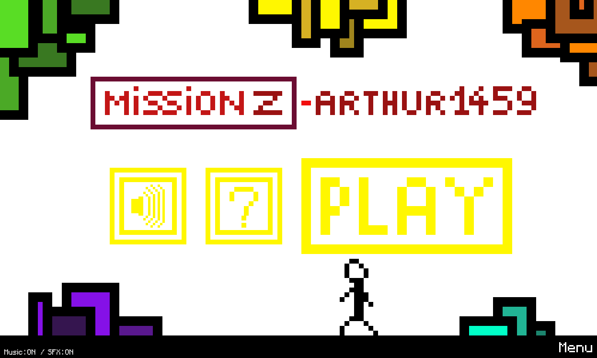
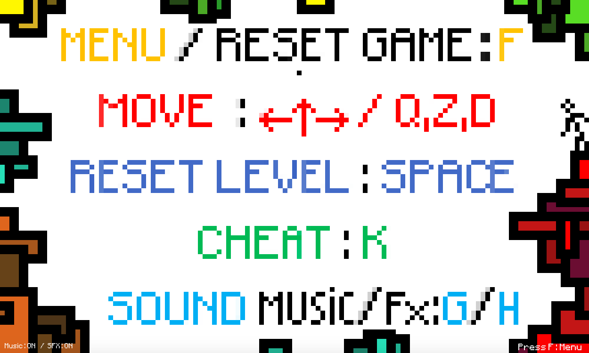
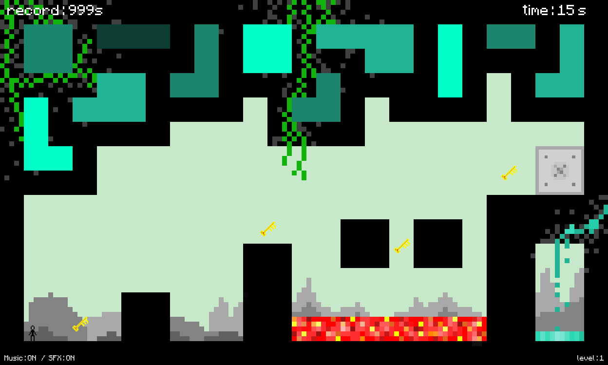
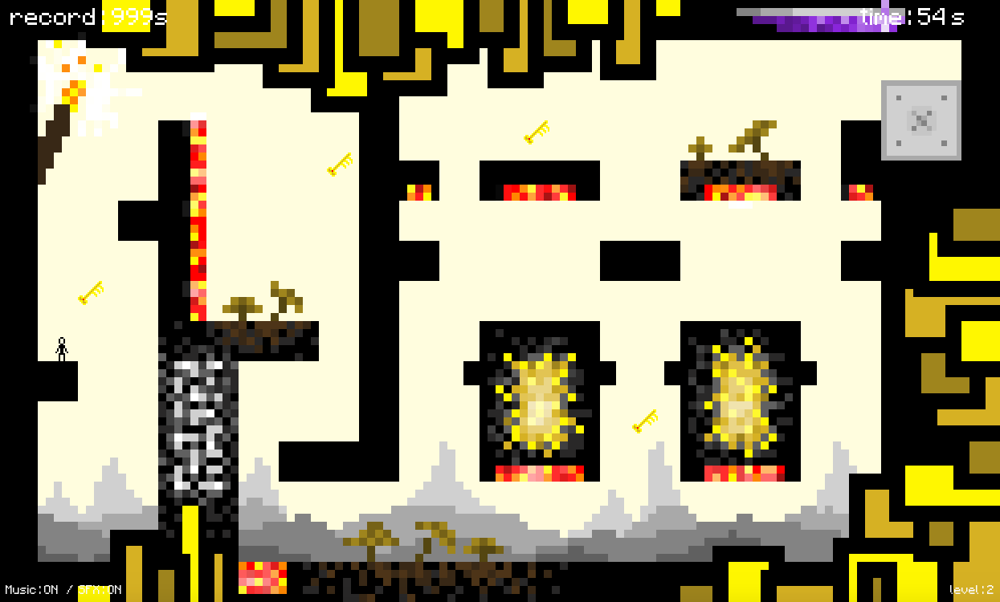

# MissionZ : Python Platformer game #

## Overview
### Introduction : 

MissionZ is a python platformer game using pygame. Through different levels, a sprites controlled
by a player need to collect four keys and reach a door by jumping on platforms and avoiding traps.

MissionZ use the pygame module, for his simplicity and his large capacities.

### Requirement to play :

To Play MissionZ, you need to have some requirements in your computer.

Python :
- python 3.9

Libraries/modules :
- pygame
- time (already in your computer if you have python)

To install a library type in your terminal/shell :
"pip3.9 install name_of_the_module"

### How to play MissionZ :

#### If you have never use github projects/python, go to "How to play.md".

First of all, to launch the game you need to launch MissionZ.py.
You can just open it with a python interpreter and run it, or directly run it from a terminal
(type "python3.9 path_to_main.py").

Controls :
- Go to menu/reset game : F
- Movements : Arrows or Q,Z,D
- Music ON/OFF : G
- SFX ON/OFF : H
- Reset current level : Space
- Pause : P
- Cheat and pass current level : K

Then you just have to avoid lava/traps, collect the four to unlock the door and reach it.
You can do wall-jumps (4 max each jump) by jumping while you are against a wall.

## Some Screenshots
The menu :

The info page :

The level 1 and 2 (I let you discover the others by playing the game) :

## How it works

### Structure :

Work in progress.

### Other :

#### Collisions : 
The sprite have 5 detectors around him (right, left, up, down, middle-down).
All of them have a state depending on what colors there is at their coordinates. They get the rgb color
with pygame function screen.get_at(x, y) and they compare this value to a color palette normalised.
Indeed, it's not the same level displayed and the level for the calculation. There is displayed level and structure's level.
Both are the same in the general shape, but the structure level is colored with specific colors according to a palette to
inform where are the walls (one color), where are the lava (one color), where are the air (one color). The palette is established
at the up-left corner (you can check it in /venv/visuals/structure/the level you want).
Then the detector update himself (update his self.state parameter) depending of the color of the pixel where he is.
Thanks to that, we can control the sprite's speed/state depending on what are there around him.

#### Sound/music :
The pygame feature pygame.mixer manage the sounds/music. There is in config.py the on/off variable
for the sounds which could be modified by pressing G or H in the keyboard. All the sounds/musics are
stored in /venv/sounds.

## Credits

Code by Arthur1459

musics : ARKTUS (spotify : https://open.spotify.com/artist/19ZpwLenlefEJ4BoeyzDjp?si=mVxCkwTcSyG1PPlEBH_1fg)

sound effects : Cymatics - Video Game Sample Pack Vol 1

Visuals/textures : by Arthur1459 with Piskel

Contact Discord : arthur1459#3467